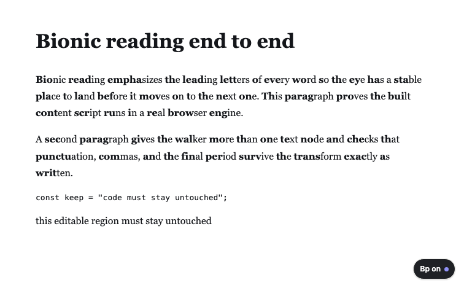

<div align="center">


**Turn any web page into a bionic reading page.**

A Manifest V3 extension for Chrome and Firefox. Five configurable reading
modes, per-site control, a fully reversible transform, and no network.

[](https://github.com/srivtx/bionic-page/actions/workflows/ci.yml)
[](https://github.com/srivtx/bionic-page/releases)
[](LICENSE)
[](https://bun.sh)
[](tsconfig.json)
[](scripts/manifest.mjs)
[](#testing)
[](#testing)
[](https://www.mozilla.org/firefox/)
[](https://www.google.com/chrome/)
[](#contributing)

[Website](https://srivtx.github.io/bionic-page) · [Features](#features) · [Modes](#modes) · [Install](#install) · [Usage](#usage) ·
[Architecture](#architecture) · [Development](#development) · [Testing](#testing) ·
[Privacy](#privacy) · [FAQ](#faq)

</div>

---

## Features

- **Five reading modes** — Classic, Half, Vowel anchor, Low distraction, and a
  Custom rule mode (`0 1 1 2 0.4`).
- **Safe by construction** — never touches `script`, `style`, `code`, `pre`,
  form fields, `contenteditable`, math, SVG, nav, or buttons, and skips URLs,
  emails, and long unbroken runs.
- **Fully reversible** — turning it off restores the original text nodes
  exactly; verified by tests that compare `innerHTML` before and after.
- **Dynamic pages and web components** — a `MutationObserver` processes SPA and
  infinite-scroll content, text a framework replaces inside an existing
  paragraph, and text inside open **shadow roots**.
- **Per-site rules** — a rules editor with one row per site: an on/off switch,
  a match pattern, and a mode and intensity that can each fall back to the
  global value. A bare hostname is normalised to a match pattern, an invalid
  pattern is refused with a message, and each row previews the URLs it will and
  will not match.
- **Toolbar badge, floating control, keyboard toggle** — see and change the
  state without opening anything (`Ctrl/Cmd+Shift+Y`).
- **Welcome page** — a short first-run guide opens automatically on install.
- **No network. No analytics. No accounts.** Settings live in the browser's own
  storage.
- **One source, two engines** — a single manifest generator emits correct
  Chrome and Firefox manifests, so they cannot drift.

## Modes

| Mode | Emphasizes | Best for |
|---|---|---|
| **Half** | The first half of each word | The familiar default |
| **Classic** | A share of each word, set by intensity | Tuning the effect up or down |
| **Vowel anchor** | Up to the first vowel group | Non-English text, long words |
| **Low distraction** | Prefix bold, remainder faded | Busy pages |
| **Custom rule** | Per-length counts plus a fraction | Exact control |

## Install

**From a store (links pending publication):** Chrome Web Store and Firefox
Add-ons.

**From source:**

```bash
git clone https://github.com/srivtx/bionic-page
cd bionic-page
bun install
bun run build
```

- Chrome / Edge: `chrome://extensions` → enable *Developer mode* →
  *Load unpacked* → select `dist/chrome`.
- Firefox: `about:debugging` → *This Firefox* → *Load Temporary Add-on* →
  select `dist/firefox/manifest.json`.

Packaged builds are attached to each
[release](https://github.com/srivtx/bionic-page/releases).

## Usage

1. Open any article and click the **Bionic Page** toolbar icon.
2. Pick a **mode** and adjust **intensity**; the page updates live.
3. Use the **This site** switch to turn the current host on or off; it creates
   or updates that host's rule. Edit the full rule list in **Options**.
4. Press `Ctrl`/`Cmd`+`Shift`+`Y` to toggle, or use the floating **Bp** control.

The walkthrough, with screenshots, is the [How it works and Controls sections](https://srivtx.github.io/bionic-page/#how) of the site.

<p align="center">
  
</p>

## Architecture

```
        popup / options ──messages──▶ background (service worker / event page)
              │                                   │  badge
              └────────── messages ──▶ content script (per frame)
                                            │
                         ┌──────────────────┼───────────────────┐
                         ▼                  ▼                   ▼
                  core/algorithm      content/domWalker    content/observer
                  (pure, tested)      (wrap + revert)      (dynamic content)
```

- `src/shared/types.ts` is the **single contract** every module imports.
- `src/core/*` is pure and DOM-free, so it is unit-testable.
- `src/content/*` owns DOM mutation and is reversible and idempotent.
- `scripts/manifest.mjs` is the only source of manifest truth.
- `site/` is the static landing page; it makes no external requests.

See [`docs/CONTRACTS.md`](docs/CONTRACTS.md) for exact interfaces and
[`docs/BRAND.md`](docs/BRAND.md) for the design system.

## Development

```bash
bun install
bun run typecheck     # tsc --noEmit
bun test              # unit + real-DOM tests
bun run build         # dist/chrome and dist/firefox
bun run verify        # every manifest-referenced file exists
bun run e2e           # real browser check over the DevTools protocol
bun run bench         # transform throughput
bun run icons         # regenerate PNG icons (zero dependencies)
bun run package       # zip both targets for store upload
bun run lint:firefox  # web-ext lint on the Firefox build
```

## Testing

| Gate | Result |
|---|---|
| `bun test` | 172 tests across 14 files |
| `bun run typecheck` | clean (strict TypeScript, noUnusedLocals) |
| `bun run build` + `verify` | both targets, all referenced files present |
| `web-ext lint` | 0 errors, 0 warnings, 0 notices |
| `bun run e2e` | 10/10 checks in real Chrome, including toggle-off restore |

The suite covers the pure algorithm (fixation rules, unicode, affixes,
unbreakable tokens), rule parsing, settings clamping, site matching, the DOM
walker (reversibility, idempotence, skip rules, SPA text replacement), the
options/options wiring, generated manifests, and loose performance budgets.
During development the verifier found and fixed a real bug: changing mode while
active did not revert the previous pass, so the change never took effect.

## Privacy

Bionic Page makes **no network requests**, has **no analytics**, and stores only
your settings in the browser's own storage. The `<all_urls>` host permission is
required to read page text locally; nothing is uploaded. See
the [`#privacy` section](https://srivtx.github.io/bionic-page/#privacy) of the site.

## FAQ

<details><summary>Is it free and open source?</summary>
Yes — MIT licensed. "Bionic Reading" is a trademark of Bionic Reading GmbH;
this project is not affiliated with or endorsed by it.</details>

<details><summary>Does it work on PDFs or canvas apps?</summary>
No. Those keep text outside the DOM, so there is nothing to transform. The
popup says so when it detects no readable text.</details>

<details><summary>Will it break websites?</summary>
It only rewrites text nodes and skips code, editors, forms, math, nav, and
anything marked <code>data-bionic="off"</code>. It is fully reversible.</details>

<details><summary>Does it slow pages down?</summary>
It transforms once, then only new content. Measured at roughly 180k–230k
words/second; see [`docs/PERFORMANCE.md`](docs/PERFORMANCE.md).</details>

<details><summary>Does it read my data?</summary>
No. There is no server and no network code in the extension.</details>

## Contributing

Issues and PRs are welcome. Before opening a PR:

```bash
bun run typecheck && bun test && bun run build && bun run verify && bun run e2e
```

## License

[MIT](LICENSE). Not affiliated with Bionic Reading GmbH.
